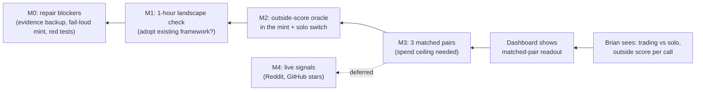

# Plan #24: Outside-Scored Mint and Trading-vs-Solo Comparison

**Status:** 📋 Planned — M0 active
**Type:** durable living plan (initiative redirect)
**Priority:** Critical
**Blocked By:** None
**Blocks:** Any further emergence or scale work

**Authority:** Brian's 2026-10-05 request ("update our plans and make them
company planning compliant"; "i trust yoru recommendations what ever they
are") plus [the product roadmap](../MVP_ROADMAP.md), which this plan's
milestones now drive.
**Planning path:** `durable_solo` — one writer, work continues across sessions,
no concurrent lanes, no shared contract mutation.
**Selected controls:** continuity = this file; uncertainty = one outside-scored
comparison with a stop rule; coordination = single lane, no work-unit graph;
reversibility = all local and git-revertible; external effect = none until M4,
which is deferred.
**Artifact consumer / decision value:** the next agent session (what to build
next and what not to) and Brian (whether the project's central bet holds).
**Stage / investment boundary:** local prototype. Model spend for M3 is the
only gated cost (see Human Decisions).
**Last outcome-bearing update:** 2026-10-05, from the review recorded below.

---

## Why the direction changed

The thesis (AE2 README) is that agents with scarce resources and no assigned
roles will produce "more together than the sum of what they could produce
alone." The previous frontier asked Brian to judge whether the Plan 23 run was
*interesting*. That question cannot test the thesis:

- **Nothing in a run has value from outside the run.** An artifact is worth
  only what the other agent pays, and new scrip comes only from the mint, whose
  scorer is an LLM grader (`src/agent_ecology3/world/mint.py:60`). Brian
  confirmed the grader was always a stand-in for real outside signals.
- **There is no solo baseline.** No run measures what the same agents earn
  working alone, so "more together" is never measured.
- **Plan 23's behavior was installed by its setup.** Its 14 decisions: each
  agent bought the other's seeded starter document, each wrote a "forecast"
  about what documents sell, each bought the other's forecast, and 5 of 14
  actions were event-log queries. The plan itself supplied payoff guidance and
  complementary seeds. This is failure mode FM-01 in
  [the failure dossier](../FAILURE_MODE_DOSSIER.md): designer-installed
  behavior. It proves the market plumbing works; it is not emergence.
- **The process grew faster than the experiment (FM-24).** Since the
  2026-09-07 sign-off every commit has been meta-process upkeep while the
  frontier waited on a judgment call.

**Plan 23 disposition (agent_decided_reversible, delegated by Brian
2026-10-05):** not accepted as an interesting-behavior exemplar. Retained as
plumbing and regression evidence alongside Plan 19. Its human-interest gate is
closed by this decision; it is not re-opened unless a later run is judged on
the new outside score.

---

## Outcome and boundaries

**Outcome:** For Brian, change "a run is judged by whether its story looks
interesting" into "a run whose dashboard shows, from an outside score, whether
the same agents earned more by trading than by working alone," within the
local-prototype boundary and a small capped model spend.

**Canonical probe:**

- *Starting state:* a small bank of tasks whose answers are checked
  automatically (for example coding problems with hidden tests, taken from an
  existing benchmark rather than written here). Two Minimal-mode principals
  with different endowments (different hints, examples, or budgets), the same
  model profile, the same hard call cap.
- *Action:* Brian launches a matched pair from the existing dashboard: one
  run with trading enabled (reads, purchases, transfers between agents) and
  one run with trading disabled (solo). Same seed, same tasks, same call cap.
- *Inspectable result:* the existing Ecosystem dashboard shows, per run, tasks
  solved by the outside checker, scrip minted from those checks, calls spent,
  and the trading run's purchases that preceded each solved task.
- *Negative case:* the trading run solves the same or fewer tasks per call
  than solo. That is a valid, reportable result, not a defect to tune away.

**Success evidence:** three matched pairs with verified binding scarcity
(failure mode FM-10) and authentic custody, read out against the stop rule
below. The readout states the per-pair difference; no significance claim.

**Explicit non-claim:** one task bank, two agents, one model, three pairs.
Says nothing general about emergence, other models, or larger populations.

**Non-goals:** Reddit, GitHub-star, or other live-world scoring (M4,
deferred); more than two agents; new dashboards or frontends; prompt tuning to
make trading win; broad evaluation matrices.

**Authority limits:** model spend for M3 needs Brian's ceiling; anything
posted outside this machine (M4) needs his exact-content approval.

| Criterion | Provenance |
|---|---|
| Outside score replaces "interesting" as the judge | derived_current_boundary (thesis in AE2 README; review 2026-10-05) |
| AI grader is a stand-in for future outside signals | explicit_user (Brian, 2026-10-05) |
| Solo baseline with matched call exposure | derived_current_boundary (FM-19, thesis wording "more together") |
| Fail loud, no substitute actions or scores | governing_authority (`AGENTS.md` design principles 2–3) |
| Pause for new model spend | governing_authority (`docs/MVP_ROADMAP.md` operating bias) |

---

## Path to the result



```text
Brian reads trading-vs-solo result
  <- dashboard renders matched-pair readout from run receipts
  <- runs record checker verdicts, mint payouts, calls spent, purchase links
  <- mint pays from an outside checker; solo condition disables trading
  <- task bank with automatic answer checks + matched endowments
```

| Capability | Canonical owner / seam | Disposition | Adoption proof |
|---|---|---|---|
| Mint scoring | `MintScorer.score_artifact` in `world/mint.py` | extend — becomes one of several scorers behind the same call; LLM grader kept as the labelled stand-in | an authentic run's mint payout cites a checker verdict, not a grader score |
| Trading on/off | action gate in the loop (`loop_action_gate_enabled` and executor) | extend — a solo condition rejects cross-principal reads/transfers | solo run receipt shows zero cross-principal actions with no fallback substitution |
| Run launch / reopen | existing dashboard launch (Plan 21) and archive reopen (Plan 20) | reuse | pair launched and reopened from the dashboard |
| Spend boundary | hard call cap (Plan 15) and Luna profile | reuse | both runs in a pair hit identical call caps |
| Run evidence storage | `~/.local/state/agent_ecology3/` + receipts | extend — bundle into git-tracked evidence | `git ls-files` lists the bundle and its SHA256 |

---

## Plan

### Milestones

| Milestone | Planning state | Inspectable output | Promotion or replan trigger |
|---|---|---|---|
| M0 Repair blockers | fully_specifiable_now (active) | evidence bundles in git; mint fails loud; `make check` green | all M0 checks pass |
| M1 Landscape check | exploration_required | short adopt/compose/keep note in `docs/adr/` | if Concordia, Magentic Marketplace, or similar runs the comparison with less work than M2, replan M2 onto it |
| M2 Outside-score oracle + solo switch | conditional on M1 = keep AE3 | provider-free fixture run where mint pays only on checker pass, and a solo run with zero trading | goes through `bounded-design` first: task bank choice and endowment design are material |
| M3 Matched-pair comparison | human_decision_required (spend ceiling) | dashboard readout of 3 pairs | stop rule below |
| M4 Live outside signals | deliberately_deferred | Reddit/GitHub-star scorer behind the same seam | M3 shows trading beats solo **and** Brian approves posting as him |

**Stop rule (decided before any M3 data):** if, across three valid pairs with
verified binding scarcity, the trading run does not solve more tasks per call
than solo in at least two pairs, record the negative result in the roadmap and
pause the project. Do not respond with prompt tuning, more seeds, or new
infrastructure; the next step after a negative result is Brian's call whether
to change the mechanism (a different design) or stop.

**Continue rule:** if trading wins in at least two of three pairs, the next
question is M4 (does it hold with real outside signals) or a larger ecology,
chosen then.

---

## Active slice: M0 — repair blockers

**Visible result:** the evidence behind every cited run survives this laptop;
`make check` reports zero failures; a mint scoring failure stops the run
instead of paying by length.

**Steps:**

1. **Evidence durability (highest severity).** Plans 19 and 23 cite run folders
   that exist only in `~/.local/state/agent_ecology3/` (no git copy found
   2026-10-05). Pack `plan19_luna_live_economic_mvp_v1` and
   `plan23_emergent_v2_run3` each into one `.tar.gz` under
   `docs/evaluations/evidence/` with a `SHA256SUMS` line, matching the existing
   evidence folders. Point the roadmap and Plans 19/23 at the bundles.
2. **Fail-loud mint.** `MintScorer.score_artifact` falls back to a length
   score on any exception (`world/mint.py:84-87`), which breaks design
   principle 2 and repeats FM-18. Make a scoring failure raise, and have the
   auction record the submission as failed with the original error. Test: a
   scorer that raises leaves balances unchanged and emits a failure event.
3. **Red tests (state as of 2026-10-05: 163 passed, 3 failed, 3 errors).**
   - `tests/test_provider_qualification.py` (3 errors) and
     `test_behavioral_comparison.py::test_preflight_...`: the child process
     cannot import `agent_ecology3` because the package is found only through
     pytest's `pythonpath`. Pass `PYTHONPATH=src` (or the package root) into
     the child environment.
   - `test_luna_recovery_gate.py::test_prompt_schema_profile_...` asserts the
     live `llm_client` checkout equals reviewed revision `2867157`; llm_client
     is now `2a3097b`. Keep the reviewed revision in receipts, but make the test
     check that the recorded revision is present and reported, not that the
     neighbouring repo never moves.
   - `test_runtime_smoke.py::test_runner_monitor_remains_responsive_...`
     (2 ticks, expected at least 5): timing-sensitive; widen the window or
     measure ticks per elapsed time.
4. **uv.** Commit `uv.lock`, ignore `*.egg-info`, and change the README quick
   start from `pip install -e .` and `~/projects/` to `uv sync` and the current
   path.
5. **Registry (project-meta).** `PROJECT_GRAPH.json` still marks
   `agent_ecology2` active and `agent_ecology3` supersedes nothing. Set
   `agent_ecology3.supersedes = ["agent_ecology2"]` and mark agent_ecology2
   superseded, through project-meta's own process.

**Focused check:** `make check` exit 0 with counts printed; `git ls-files
docs/evaluations/evidence | grep -E 'plan(19|23)'` lists both bundles;
`sha256sum -c` passes.

**Failure / containment:** every step is a separate commit and revertible.
Step 1 copies; it never moves or deletes the originals.

---

## Decisions and assumptions

| Choice | Disposition | Reason / evidence |
|---|---|---|
| Plan 23 not accepted as interesting-behavior exemplar | agent_decided_reversible (Brian delegated 2026-10-05) | behavior traced to seeded setup (FM-01); see "Why the direction changed" |
| The judge becomes an outside automatic checker | agent_decided_reversible | the thesis needs value from outside the run; the checker is fast enough for 14–40-call runs |
| AI grader is a stand-in for future outside signals | human_set (Brian, 2026-10-05) | kept as a labelled scorer behind the same seam |
| Reddit/GitHub stars deferred to M4 | agent_decided_reversible | hours-to-days latency, sparse and noisy signal, and posting goes out under Brian's account |
| Use an existing task bank, not a hand-written one | agent_decided_reversible | integrate-before-build; final choice in M2 bounded design |
| Different endowments per agent | assumption | trading can only help if agents hold different useful things; the endowment is the manipulation, stated openly, not hidden in prompts. If wrong (agents never trade even when it pays), that is the negative result |
| Three pairs, no significance test | agent_decided_reversible | decides continue/pause for a prototype; a stronger claim would need its own plan |
| Landscape check before M2 | agent_decided_reversible | no prior survey of Concordia, Magentic Marketplace, GovSim, or similar exists in AE2/AE3 docs (searched 2026-10-05); FM-07 is open |

## Evidence and current state

| Claim | Evidence | Limitation |
|---|---|---|
| Market plumbing works end to end | Plan 19 and Plan 23 sign-offs | single runs; run folders not yet in git (M0 step 1) |
| Mint scores with an LLM grader and pays by length on failure | `src/agent_ecology3/world/mint.py:50-93` | read 2026-10-05 |
| No Reddit or GitHub-star scoring exists in code | search of AE2/AE3 `src`, `docs`, `config`, 2026-10-05: hits only in AE2 docs (`DEFERRED_FEATURES.md`, `05_contracts.md`, plans 254 and 309) | — |
| Test suite red | `uv run pytest -rfE`: 163 passed, 3 failed, 3 errors, exit 1 (2026-10-05) | — |

## Human decisions

- **M3 spend ceiling** (needed before M3, not before M0–M2). Recommendation:
  USD 5 total for the canary plus three matched pairs. If unanswered, M0–M2
  proceed and M3 does not start.

## Exact next action

Execute M0 step 1: pack the Plan 19 and Plan 23 run folders into
`docs/evaluations/evidence/` with SHA256 sums and commit them on a
`plan-24-m0-*` branch.
