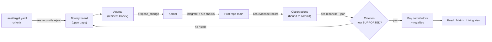

# Plan #27: Shared Projects Judged by AES

**Status:** 📋 Planned — M1 next (pilot project scaffold)
**Type:** durable living plan (company-planning `durable_solo`)
**Priority:** Critical
**Blocked By:** None
**Blocks:** later scale runs on a real oracle (Plan 25 M10)

**Authority:** Brian, 2026-10-06: chose "shared projects" as the next oracle
("sure i think this might couple well with agentic engineering system
canonical"), then "proceed". Earlier the same day: the stand-in puzzle oracle is
not to be hardened, and web look-ups are a legitimate strategy with a real
oracle. This plan owns its milestones, active slice and review log;
[the roadmap](../MVP_ROADMAP.md) owns outcome and priority; [Plan 26](26_watch_the_ecology.md)
owns the views this plan reuses.
**Planning path:** `durable_solo` — one writer, continues across sessions. Two
repositories are involved: agent_ecology3 (owner of everything built here) and
`agentic-engineering-system-canonical` (AES; used as an installed tool, never
edited by this plan).
**Selected controls:** continuity = this file; coordination = single lane plus
read-only use of AES; reversibility = git-revertible PRs merged after
`make check`; external effect = none beyond the public repo; isolation = agents
edit only a sandbox clone of the pilot project, never AES or agent_ecology3.
**Artifact consumer / decision value:** Brian watches agents build one real
codebase together, paid only when AES records test evidence that a success
criterion is met, and decides whether this oracle produces cooperation worth
scaling.
**Stage / investment boundary:** local prototype; no verdict on whether
cooperation pays (that needs scale); no benchmarks.
**Last outcome-bearing update:** 2026-10-06, plan created.

## Outcome and boundaries

**Outcome:** For Brian, change "agents paid for hidden-test passes on
independent puzzles, so they rarely trade or talk" into "agents paid by AES
evidence for advancing one shared, AES-governed codebase whose parts depend on
each other", visible in the existing feed, matrix and Living view.

**Canonical probe:** `aes init` a pilot project whose success criteria come from
a real library's own tests; 4 resident Codex agents × 20 turns edit its sandbox;
after each submitted change the kernel runs `aes evidence record` and
`aes reconcile --json`; a criterion moving INSUFFICIENT → SUPPORTED pays the
agents whose code the passing commit contains; a later change that makes the
evidence STALE without new support stops that payment. Negative case: a change
that breaks an already-supported criterion is recorded and shown, and pays
nothing.

**Review points (each a clickable UI):**
- M1: `aes status` of the pilot project and its open gaps, shown in the dashboard as the job board.
- M3: the live 4-agent run (feed, matrix, Living view).
- M4: the same run in the public replay.

**Non-goals:**
- running agents on AES canonical itself;
- editing AES (gaps in AES become issues on its repo);
- new view types (reuse Plan 26's views);
- cooperation verdicts.

**Authority limits:**
- AES changes go through AES's own plans and owners;
- the pilot project is a sandbox clone, so nothing is pushed to the upstream library.

## System model (PMI-017)

Extends [docs/model/ae3_model.yaml](../model/ae3_model.yaml) and
[ODD.md](../model/ODD.md); M2 updates both, and the drift test must stay green.

- **New entities:**
  - pilot project (sandbox git repo plus `.aes/target.yaml`);
  - success criterion (id, standing: INSUFFICIENT / SUPPORTED / REFUTED);
  - observation (id, freshness: CURRENT / STALE);
  - bounty (one per open AES gap, with an amount);
  - contribution (agent, commit, files).
- **New processes:**
  - `propose_change` (agent writes files in its sandbox branch, then submits);
  - `integrate` (kernel merges a submitted change into the pilot's main if it applies cleanly and the pilot's checks pass);
  - `judge` (kernel runs `aes evidence record` for affected verification subjects, then `aes reconcile --json`);
  - `pay` (bounty for criteria that became SUPPORTED, split by contribution; royalty when a contribution imports or calls another agent's code).
- **New events:**
  - `change_submitted`
  - `change_integrated` / `change_rejected` (with reason)
  - `aes_judged` (criterion standings before and after, observation ids)
  - `bounty_paid`
  - `royalty_paid` (existing type, new source)
- **Expected patterns** (what we look for, not verdicts):
  - agents read the open-gap list;
  - agents build on each other's modules (imports across authors);
  - messaging or payments appear when a gap needs more than one agent's code;
  - broken criteria are noticed and repaired.



## Plan

M1 scaffolds the pilot project and its AES target; M2 adds the kernel adapter
that judges and pays from AES evidence; M3 runs 4 agents live; M4 republishes
the replay; M5 (scale) waits for Brian. Details below.

## Milestones

| Milestone | Planning state | Output | Review point |
|---|---|---|---|
| M1 Pilot project scaffold | fully_specifiable_now (next) | One small real Python library chosen (Commit0 lite, MIT, smallest with clear module dependencies; candidates checked, not assumed); its function bodies stubbed in a sandbox repo; `aes init` with criteria = groups of the library's own tests; `aes status` shows every criterion INSUFFICIENT; a dashboard panel lists the open gaps as bounties | pilot `aes status` in the dashboard |
| M2 Kernel adapter for AES judging | fully_specifiable_now | `propose_change` / `integrate` / `judge` / `pay` in the resident gateway; AES called as a subprocess on the sandbox; model YAML, ODD and drift test updated; tests with a scripted agent (no model calls) prove pay on SUPPORTED, no pay on REFUTED or STALE, royalty on cross-author import | test run + feed rows on a scripted run |
| M3 4-agent live run | conditional (after M2) | 4 Codex agents × 20 turns on the pilot, systemd unit; record criteria met, contributions per agent, cross-author imports, messages, payments | live dashboard link |
| M4 Public replay | conditional (after M3) | republish via `scripts/deploy_public_replay.sh` after the leak check (pilot library code is MIT, so code may be shown; agent notes still checked) | brianmills.dev/agent-ecology/ |
| M5 Scale | deliberately_deferred | 16+ agents, longer runs, larger library | Brian selects it |

## Active slice: M1 — pilot project scaffold

**Steps:**
1. Read the Commit0 dataset or repo for the lite split. Pick the smallest library (by functions and tests) that has at least 3 modules importing each other. Record the choice, its licence and its counts.
2. Create a sandbox git repo outside agent_ecology3 (e.g. `~/.local/state/agent_ecology3/pilots/<lib>`). Use the library at its pinned commit with function bodies replaced by `raise NotImplementedError` (Commit0's own stubbing). Keep the tests intact.
3. `aes init --project-id ae3-pilot-<lib> --actor "agent_ecology3 agents" --outcome "<lib> works as its tests specify"`. Add one criterion per test module, and one verification subject per criterion that runs that module's tests. Accept the target through `aes plan prepare/validate/accept`.
4. `aes status`: all criteria INSUFFICIENT. A reference run with the original bodies restored makes all criteria SUPPORTED (proves the oracle can say yes), then the repo is reset to stubs.
5. A dashboard panel lists `aes reconcile --json` gaps as bounties (tooltips; blue/orange).

**Focused check:** stubbed: 0 supported; reference: all supported; the panel's gap count equals `reconcile --json`'s.

**Failure / containment:**
- If AES cannot express per-test-module criteria cleanly, record the exact gap as an issue on AES and use the closest supported form.
- If no lite library fits, take the smallest full-split one and say why.

## Decisions and assumptions

| Choice | Disposition | Reason / evidence |
|---|---|---|
| Next oracle = shared projects judged by AES | human_set (Brian, 2026-10-06) | quotes above |
| Pilot on a sandbox library, not AES itself | agent_decided_reversible | agents editing the governance tool is unsafe for a first run |
| Criteria from the library's own tests | agent_decided_reversible | nobody hand-writes the jobs; tests are the outside checker |
| Pay only on AES-recorded SUPPORTED evidence; stale stops pay | agent_decided_reversible | evidence is bound to the commit (AES v0.2 design) |

**Wrong when:** after M3, revisit the oracle if agents still show no cross-author imports and no messages or payments while open gaps span more than one agent's modules, or if `aes evidence record` per change makes a 20-turn run take more than 3× a CodeFlowBench run.

## Human decisions

- **M5:** whether and when to scale; not needed before M3.

## Review log

| Date | Milestone | What Brian can open | Result |
|---|---|---|---|

## Exact next action

M1 step 1: choose the pilot library from the Commit0 lite split and record its
counts.

## Goal text (to start this plan)

```
/goal Make agent_ecology3's resident Codex agents build one shared, AES-governed codebase and get paid only by AES evidence, per Plan 27 (docs/plans/27_aes_shared_projects.md), and show it working.

Done when:
1. M1: a pilot sandbox repo of one small real Python library (from Commit0's lite split, chosen and recorded with licence and counts) with function bodies stubbed, governed by `aes init` with one criterion per test module. `aes status` shows all criteria INSUFFICIENT on the stubs and all SUPPORTED on a reference run. The dashboard lists the open gaps as bounties.
2. M2: the resident gateway supports propose_change / integrate / judge / pay, calling AES as a subprocess. Scripted-agent tests (no model calls) prove pay on SUPPORTED, no pay on REFUTED or STALE, and a royalty on a cross-author import. docs/model is updated and its drift test passes.
3. M3: one 4-agent, 20-turn Codex run on the pilot, run as a systemd unit, recorded in Plan 27: criteria met, contributions per agent, cross-author imports, messages and payments, with a redacted bundle and a Living view screenshot.
4. M4: the run is republished at brianmills.dev/agent-ecology/ after the leak check.
5. make check on main shows its counts and exits 0. Plan 27's milestones and exact next action match what happened. Report PR numbers, run ids and counts.

Boundaries: agent_ecology3 PRs merged after make check. AES is used as an installed tool and never edited (file issues there). Agents edit only the pilot sandbox. Codex agents only, low effort. Never delete run evidence. Bundles exclude Codex folders and secrets.

Forbidden: running agents on AES canonical or agent_ecology3 itself; hand-written criteria or jobs; paying from anything but AES evidence and kernel events; any verdict on whether cooperation pays.
```
